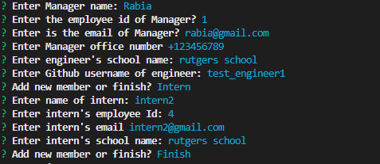
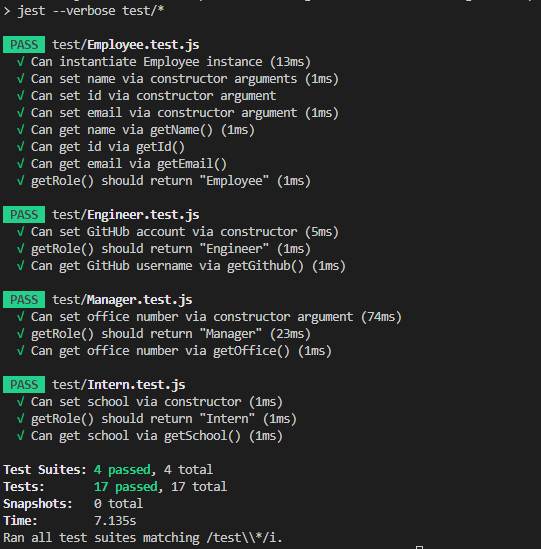
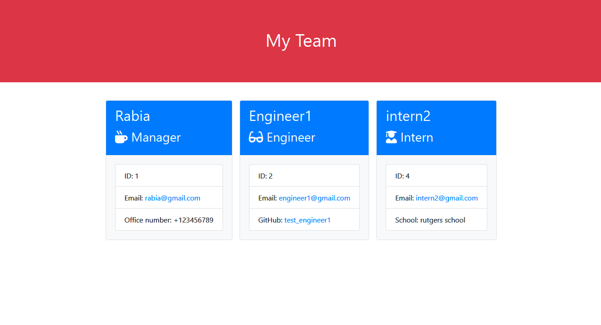

# Introduction:

Team generator command-line application powered by Node js with clean code. You can quickly and easily create a your work teams by using a command-line application to generate one.

You can answer to questions and after you answer all the questions you team file will be generated.

## Developer Insights:

I am thankful to my instructors at RutgersCodingBootcamp, that they teach me so well and I have crated this coding application.

## Resources:

-   [W3SCHOOLS.COM](https://www.w3schools.com/nodejs/)
-   [INQUIRER.JS](https://www.npmjs.com/package/inquirer/v/8.2.4)

## Third-Party packages:

-   [INQUIRER.JS](https://www.npmjs.com/package/inquirer/v/8.2.4)

## How to run:

index.js is the main file of the application.

You can run the application by opening the terminal in your MAC and type following:

node index.js

## ScreenShots

**All Questions:**

**JEST TESTS:**

**Frontend Output:**

